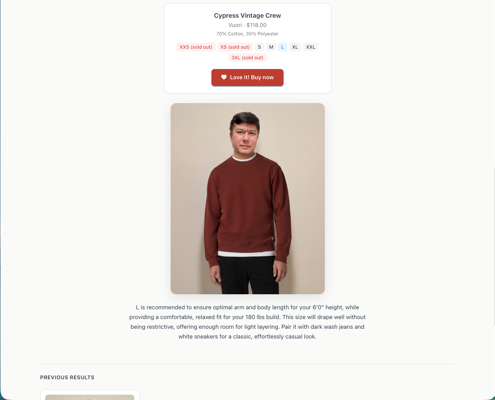
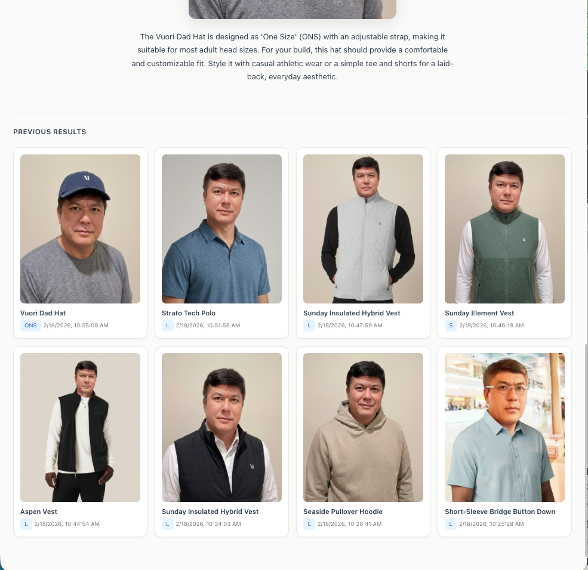

# Love N Fit — Virtual Try-On

AI-powered virtual try-on app that lets you upload a photo, find Vuori clothing products via a RAG chatbot, and see how they look on you — with personalized size recommendations.

## Screenshots

### Upload & Chat
Upload your photo, chat with the AI shopping assistant to find the perfect product, and enter your measurements.


### Try-On Result
See yourself wearing the product with AI-generated imagery, along with product details, available sizes, and a personalized size recommendation.



### Try-On History
Browse all your previous try-on results in a visual grid.



## Features

- Upload a person photo + enter height/weight measurements
- **RAG chatbot** powered by FAISS + Gemini embeddings searches 2,100+ Vuori products
- AI-generated try-on image using Google Gemini image generation
- Personalized **size recommendation** based on body measurements
- "Love it!" button opens the product page for easy purchasing
- Dark/light mode, try-on history

## Tech Stack

| Frontend | Backend | AI & Data |
|----------|---------|-----------|
| React + Vite | FastAPI | Google Gemini (image gen + text + embeddings) |
| Ant Design | Uvicorn | FAISS vector database (2,100+ products) |
| Tailwind CSS | Poetry (Python 3.12+) | BeautifulSoup (product scraping) |

## Setup

### 1. Clone

```bash
git clone https://github.com/gheniabla/love-n-fit.git
cd love-n-fit/Gen-AI-Virtual-Try-On-Clothes
```

### 2. Backend

```bash
cd backend
poetry install
```

Create `.env`:

```
GEMINI_API_KEY=your_gemini_api_key_here
```

Index products (first time only):

```bash
poetry run python -m scripts.index_products
```

Run the server:

```bash
poetry run uvicorn main:app --reload
```

### 3. Frontend

```bash
cd frontend
npm install
npm run dev
```

## API Endpoints

```
POST /api/try-on    — Virtual try-on (person image + product URL + measurements)
POST /api/chat      — RAG chatbot (product search + recommendations)
```

## Project Structure

```
/frontend           # React + Ant Design + Tailwind UI
/backend
  /routers          # FastAPI endpoints (tryon, chat)
  /utils            # Vuori scraper, FAISS vector store
  /scripts          # Product indexing script
  /data             # FAISS index + products.json
```

## License

MIT
